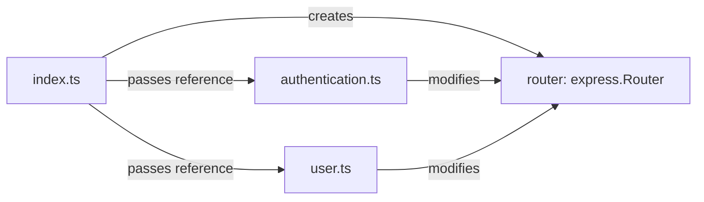

# 1. A beginners guide to build a user Authentication server (JWT) via nodejs typescript

## 1.1. Table of content

- [1. A beginners guide to build a user Authentication server (JWT) via nodejs typescript](#1-a-beginners-guide-to-build-a-user-authentication-server-jwt-via-nodejs-typescript)
  - [1.1. Table of content](#11-table-of-content)
  - [1.2. installation](#12-installation)
    - [1.2.1. install typescript and nodemon](#121-install-typescript-and-nodemon)
    - [1.2.2. config typescript](#122-config-typescript)
    - [1.2.3. config nodemon](#123-config-nodemon)
  - [1.3. create folder structure](#13-create-folder-structure)
    - [1.3.1. index.ts](#131-indexts)
    - [1.3.2. package.json update](#132-packagejson-update)
      - [1.3.2.1. test](#1321-test)
  - [1.4. Set up express server](#14-set-up-express-server)
    - [1.4.1. install the dependence](#141-install-the-dependence)
    - [1.4.2. install dependence types](#142-install-dependence-types)
    - [1.4.3. add listener to the server we just created](#143-add-listener-to-the-server-we-just-created)
      - [1.4.3.1. test](#1431-test)
  - [1.5. setup mongodb in src/index.ts](#15-setup-mongodb-in-srcindexts)
    - [1.5.1. init mongoose in src/index.ts](#151-init-mongoose-in-srcindexts)
  - [1.6. Create first database schema](#16-create-first-database-schema)
    - [1.6.1. create folder db and uers.ts](#161-create-folder-db-and-uersts)
    - [1.6.2. **Explanation**](#162-explanation)
    - [1.6.3. **Define the User Schema**](#163-define-the-user-schema)
    - [1.6.4. **Create the User Model**](#164-create-the-user-model)
      - [1.6.4.1. **Utility Functions**](#1641-utility-functions)
      - [1.6.4.2. **1. Get All Users**](#1642-1-get-all-users)
      - [1.6.4.3. **2. Get a User by Email**](#1643-2-get-a-user-by-email)
      - [1.6.4.4. **3. Get a User by Session Token**](#1644-3-get-a-user-by-session-token)
      - [1.6.4.5. **4. Get a User by ID**](#1645-4-get-a-user-by-id)
      - [1.6.4.6. **5. Create a New User**](#1646-5-create-a-new-user)
      - [1.6.4.7. **6. Delete a User by ID**](#1647-6-delete-a-user-by-id)
      - [1.6.4.8. **7. Update a User by ID**](#1648-7-update-a-user-by-id)
      - [1.6.4.9. **Summary**](#1649-summary)
  - [1.7. create helper folder and its index.ts for authetication](#17-create-helper-folder-and-its-indexts-for-authetication)
    - [1.7.1. `crypto.createHmac('sha256', [salt, password].join('/'))`](#171-cryptocreatehmacsha256-salt-passwordjoin)
    - [1.7.2. `.update(SECRET)`](#172-updatesecret)
    - [1.7.3. `.digest('hex')`](#173-digesthex)
    - [1.7.4. What does this line do overall?](#174-what-does-this-line-do-overall)
    - [1.7.5. Example of Usage](#175-example-of-usage)
    - [1.7.6. Why is this useful?](#176-why-is-this-useful)
    - [1.7.7. Important Notes](#177-important-notes)
  - [1.8. create routing for authetication in controllers](#18-create-routing-for-authetication-in-controllers)
  - [1.9. create a route](#19-create-a-route)
    - [1.9.1. Create router authentication](#191-create-router-authentication)
      - [1.9.1.1. updat router/index.ts](#1911-updat-routerindexts)
      - [1.9.1.2. update the src/index.ts](#1912-update-the-srcindexts)
  - [1.10. test out registration in postman](#110-test-out-registration-in-postman)
  - [1.11. create login controllers](#111-create-login-controllers)
    - [1.11.0.1. explain this line =\> const user = await getUserByEmail(email).select('+authentication.salt](#11101-explain-this-line--const-user--await-getuserbyemailemailselectauthenticationsalt)
    - [1.11.0.2. **1. `const user = await getUserByEmail(email)`**](#11102-1-const-user--await-getuserbyemailemail)
    - [1.11.0.3. **2. `.select('+authentication.salt +authentication.password')`**](#11103-2-selectauthenticationsalt-authenticationpassword)
    - [1.11.0.4. **What does this do in practice?**](#11104-what-does-this-do-in-practice)
    - [1.11.0.5. **Example Use Case**](#11105-example-use-case)
    - [1.11.0.6. **Mongoose Example**](#11106-mongoose-example)
    - [1.11.0.7. **Why Use `.select()`?**](#11107-why-use-select)
    - [1.11.0.8. **Important Note**](#11108-important-note)
    - [1.11.1. create the login function - login controller and the authentication function](#1111-create-the-login-function---login-controller-and-the-authentication-function)
      - [1.11.1.1. Explaination of how cookies, session and http header works](#11111-explaination-of-how-cookies-session-and-http-header-works)
      - [1.11.1.2. Explaination of how session token works](#11112-explaination-of-how-session-token-works)
      - [1.11.1.3. Example of a cookie](#11113-example-of-a-cookie)
  - [1.12. Test login function using postman](#112-test-login-function-using-postman)
  - [1.13. Create users route using our first middleware](#113-create-users-route-using-our-first-middleware)
    - [1.13.1. Key Points](#1131-key-points)
    - [1.13.2. **Steps to Fix the Issue** Error: Cannot set headers after they are sent to the client](#1132-steps-to-fix-the-issue-error-cannot-set-headers-after-they-are-sent-to-the-client)
      - [1.13.2.1. **1. Check the Middleware (`src/middlewares/index.ts`)**](#11321-1-check-the-middleware-srcmiddlewaresindexts)
      - [1.13.2.2. **2. Check Controller Logic**](#11322-2-check-controller-logic)
      - [1.13.2.3. **3. Avoid Duplicate `next()` Calls**](#11323-3-avoid-duplicate-next-calls)
      - [1.13.2.4. **4. Check for Unhandled Promises**](#11324-4-check-for-unhandled-promises)
    - [1.13.3. **Best Practices to Avoid This Issue**](#1133-best-practices-to-avoid-this-issue)
    - [1.13.4. Debugging Tips](#1134-debugging-tips)
  - [1.14. Create users route using our first middleware](#114-create-users-route-using-our-first-middleware)
  - [1.15. create a new router](#115-create-a-new-router)
  - [1.16. update router index.ts to](#116-update-router-indexts-to)
    - [1.16.1. Explanation of the Folder Structure](#1161-explanation-of-the-folder-structure)
    - [1.16.2. **Controllers (`controllers/`)**](#1162-controllers-controllers)
    - [1.16.3. **Router (`router/`)**](#1163-router-router)
    - [1.16.4. **Middlewares (`middlewares/`)**](#1164-middlewares-middlewares)
    - [1.16.5. **Database (`db/`)**](#1165-database-db)
    - [1.16.6. Diagram Representation of Folder Interactions](#1166-diagram-representation-of-folder-interactions)
    - [1.16.7. Step-by-Step Workflow](#1167-step-by-step-workflow)
    - [1.16.8. Summary Table](#1168-summary-table)
  - [1.17. Test the login with the user get function](#117-test-the-login-with-the-user-get-function)
    - [1.17.1. Get all the user](#1171-get-all-the-user)
  - [1.18. create delete and update for our users](#118-create-delete-and-update-for-our-users)
    - [1.18.1. **1. How Session-Based Authentication Works**](#1181-1-how-session-based-authentication-works)
    - [1.18.2. **2. Accessing Session Data in `isOwner`**](#1182-2-accessing-session-data-in-isowner)
      - [1.18.2.1. Updated `isOwner` Function](#11821-updated-isowner-function)
    - [1.18.3. **3. Setting Up Session Middleware**](#1183-3-setting-up-session-middleware)
      - [1.18.3.1. Install Required Packages](#11831-install-required-packages)
      - [1.18.3.2. Middleware Configuration](#11832-middleware-configuration)
      - [1.18.3.3. Apply Middleware](#11833-apply-middleware)
    - [1.18.4. **4. Logging In with Sessions**](#1184-4-logging-in-with-sessions)
      - [1.18.4.1. Example Login Route](#11841-example-login-route)
    - [1.18.5. **5. Logout Implementation**](#1185-5-logout-implementation)
      - [1.18.5.1. Example Logout Route](#11851-example-logout-route)
    - [1.18.6. **6. Comparing Against MongoDB**](#1186-6-comparing-against-mongodb)
      - [1.18.6.1. Example with Database Lookup in `isOwner`](#11861-example-with-database-lookup-in-isowner)
    - [1.18.7. **7. Key Differences Between Session and JWT**](#1187-7-key-differences-between-session-and-jwt)
    - [1.18.8. **Conclusion**](#1188-conclusion)
  - [1.19. Quick summary](#119-quick-summary)
  - [1.20. Create the update controller](#120-create-the-update-controller)
- [2. Reference](#2-reference)

## 1.2. installation

### 1.2.1. install typescript and nodemon

  ```sh
  pnpm init

  pnpm add -D typescript

  pnpm add -D ts-node

  pnpm add -D nodemon
  ```

  Nodemon is a development tool that automatically restarts a Node.js application whenever file
  changes are detected in the project.
  
  You may also perform the installation with one line
  
  ```sh
  pnpm init

  pnpm add -D typescript ts-node nodemon
  ```

### 1.2.2. config typescript

  Create tsconfig.json at root folder (layer 0)
  This is a TypeScript configuration file (tsconfig.json) that specifies how the TypeScript compiler
  (tsc) should behave and how it should compile your TypeScript code. Let’s go through each setting,
  line by line.

```json
  {
      "compilerOptions": {
          "module": "NodeNext",                // Uses Node.js's ESM/CommonJS module system.
          "moduleResolution": "node",         // Resolves modules using Node.js's strategy.
          "baseUrl": "src",                   // Non-relative imports are resolved relative to 'src'.
          "outDir": "dist",                   // Compiled JavaScript files are output to 'dist'.
          "sourceMap": true,                  // Generates source maps for debugging.
          "noImplicitAny": true               // Enforces explicit typing, disallowing implicit 'any'.
      },
      "include": ["src/**/*"]                 // Includes all files in 'src' for compilation.
  }
  ```

  For details explaination, please checktout [typescript compilation explaination](typescript-compilation-file.md).

### 1.2.3. config nodemon

  ```json
  {
      "watch": ["src"],
      "ext": ".ts,.js",
      "exec": "ts-node ./src/index.ts"
  }
  ```

  This is a **`nodemon.json` configuration file** that customizes **Nodemon's behavior** for your
  project. It defines what files to watch, which file extensions to monitor, and what command to
  execute when files change.

  Let’s break it down line-by-line:
    Here’s what this configuration does:

  1. **Watch the `src` directory**:
     - Nodemon monitors all files in `src` and its subdirectories.
  2. **Restart on `.ts` or `.js` file changes**:
     - Nodemon restarts the process whenever a file with the `.ts` or `.js` extension is modified.
  3. **Execute `ts-node`**:
     - When a file change is detected, Nodemon runs the `ts-node` command to execute
     `./src/index.ts` (or the equivalent entry point).

  Conclusion:

  This `nodemon.json` helps streamline the development process for a TypeScript project by:

- Automatically restarting the application whenever `.ts` or `.js` files in the `src` folder
  change.
- Leveraging `ts-node` to avoid pre-compiling TypeScript files, saving time during development.

  By ensuring the correct configuration, you'll have a smoother TypeScript development workflow!

  Remarks: also see [this](nodemonConfig.md)

## 1.3. create folder structure

### 1.3.1. index.ts

  windows:

  ```bat
  powershell
  mkdir src; New-Item -Path src\index.ts -ItemType File
  ```

  linux:

  ```sh
  mkdir src && touch src/index.ts
  ```

  in index.ts

  ```ts
  console.log("hello typescript");
  ```

### 1.3.2. package.json update

  ```json
  //...
  scripts:{
      "start": "nodemon",
      //...
  }
  ```

#### 1.3.2.1. test

  pnpm start

  output:
  [nodemon] 3.1.7
  [nodemon] to restart at any time, enter `rs`
  [nodemon] watching path(s): src\**\*
  [nodemon] watching extensions: ts,js
  [nodemon] starting `ts-node ./src/index.ts`
  hello typescript
  [nodemon] clean exit - waiting for changes before restart

## 1.4. Set up express server

  src/index.ts

  ```ts
  import express from 'express';
  import http from 'http';
  import bodyParser from 'body-parser';
  import cookieParser from 'cookie-parser';
  import compression from 'compression';
  import cors from 'cors';

  const app = express();

  app.use(
      cors({
          credentials: true,
      })
  );
  app.use(compression());
  app.use(cookieParser());
  app.use(bodyParser.json());

  const server = http.createServer(app);

  ```

### 1.4.1. install the dependence

  pnpm i express body-parser cookie-parser compression cors

### 1.4.2. install dependence types

  pnpm i -D @types/express @types/body-parser @types/cookie-parser @types/compression @types/cors

### 1.4.3. add listener to the server we just created

  ```ts
  //...
  server.listen(8080, ()=>{
      console.log("Server running on http://localhost:8080/")
  })
  ```

#### 1.4.3.1. test

  pnpm start

  and go to browser

## 1.5. setup mongodb in src/index.ts

  Windows setup local mongodb

  ```ts
  //...
  const MONGO_URL = 'mongodb://localhost:27017/interact';
  ```

  ```sh,bat
  pnpm add mongoose
# pnpm add -D @types/mongoose

# Mongoose publishes its own types, so you do not need to install this package
# pnpm remove @types/mongoose
  ```

### 1.5.1. init mongoose in src/index.ts

  ```ts
  //...
  mongoose.Promise = Promise;
  mongoose.connect(MONGO_URL);
  mongoose.connection.on('error', (error:Error) => console.log(error));
  ```

## 1.6. Create first database schema

### 1.6.1. create folder db and uers.ts

  ```powershell
  New-Item -ItemType Directory -Path src\db -Force; New-Item -ItemType File -Path src\db\users.ts
  ```

  ```sh
  mkdir -p src/db && touch src/db/users.ts
  ```

  ```ts
  import mongoose from 'mongoose';

  const UserSchema = new mongoose.Schema({
      username: {type: String, required: true},
      email: {type: String, required: true},
      authentication:{
          password: {type: String, required: true, select: false},// we don't want to fetch user
info along with their authentication data
          salt: {type:String, select: false},
          sessionToken: {type: String, select:false},
      }
  });

  export const UserModel = mongoose.model('User', UserSchema);

  export const getUsers = () => UserModel.find();
  export const getUserByEmail = (email:string) => UserModel.findOne({email});
  export const getUserBySessionToken = (sessionToken:String) =>
UserModel.findOne({'authentication.sessionToken': sessionToken,})
  export const getUserById = (id: string) => UserModel.findById(id);
  export const createUser = (values: Record<string, any>) => new UserModel(values).save().then(user
=> user.toObject());
  export const deleteUserById = (id: string) => UserModel.findOneAndDelete({_id: id});
  export const updateUserById = (id: string, values: Record<string, any>) => {
      return UserModel.findOneAndUpdate(
        { _id: id },            // Filter: Find the user by their `_id`
        { $set: values },       // Update: Set the fields in `values`
        { new: true }           // Options: Return the updated document
      );
    };
  ```

  Here's a detailed explanation of your code with inline comments for each part:

### 1.6.2. **Explanation**

  ```typescript
  import mongoose from 'mongoose';
  ```

- **Imports the `mongoose` library**: This is used to interact with a MongoDB database in a
  structured way using schemas and models.

  ---

### 1.6.3. **Define the User Schema**

  ```typescript
  const UserSchema = new mongoose.Schema({
      username: {type: String, required: true},
      email: {type: String, required: true},
      authentication:{
          password: {type: String, required: true, select: false}, // Do not include `password` in
query results by default
          salt: {type:String, select: false},                      // Do not include `salt` in query
results by default
          sessionToken: {type: String, select:false},              // Do not include `sessionToken`
in query results by default
      }
  });
  ```

  1. **`UserSchema`**: Defines the structure of a `User` document in MongoDB.
     - `username`: A required `String` field.
     - `email`: Another required `String` field.
     - `authentication`: A nested object that stores sensitive authentication details like:
       - `password`: The user's hashed password (not included in query results by default due to
       `select: false`).
       - `salt`: The salt used to hash the password (also excluded from query results).
       - `sessionToken`: A token for maintaining user sessions (also excluded from query results).

     > **Note**: `select: false` ensures sensitive fields like `password`, `salt`, and
     > `sessionToken` are not fetched unless explicitly requested in the query.

  ---

### 1.6.4. **Create the User Model**

  ```typescript
  export const UserModel = mongoose.model('User', UserSchema);
  ```

- **Creates the `User` model**: This connects the `UserSchema` to the `User` collection in your
  MongoDB database.
- The `UserModel` is used to perform actions (e.g., CRUD operations) on documents in the `User`
  collection.

  ---

#### 1.6.4.1. **Utility Functions**

#### 1.6.4.2. **1. Get All Users**

  ```typescript
  export const getUsers = () => UserModel.find();
  ```

- **Fetch all users** in the database.
- This uses `UserModel.find()` to retrieve all documents in the `User` collection.

  ---

#### 1.6.4.3. **2. Get a User by Email**

  ```typescript
  export const getUserByEmail = (email: string) => UserModel.findOne({email});
  ```

- **Fetch a single user by their email address**:
  - `findOne({ email })`: Finds the first document where the `email` field matches the provided
    value.

  ---

#### 1.6.4.4. **3. Get a User by Session Token**

  ```typescript
  export const getUserBySessionToken = (sessionToken: String) =>
UserModel.findOne({'authentication.sessionToken': sessionToken});
  ```

- **Fetch a user by their session token**:
  - Searches for a document where the `authentication.sessionToken` field matches the given token.

  ---

#### 1.6.4.5. **4. Get a User by ID**

  ```typescript
  export const getUserById = (id: string) => UserModel.findById(id);
  ```

- **Fetch a user by their unique ID**:
  - Uses `findById(id)` to retrieve a document by its `_id` field (MongoDB's unique identifier for
    documents).

  ---

#### 1.6.4.6. **5. Create a New User**

  ```typescript
  export const createUser = (values: Record<string, any>) =>
      new UserModel(values).save().then(user => user.toObject());
  ```

- **Create and save a new user**:
  - `new UserModel(values)`: Creates a new instance of the `UserModel` with the provided data.
  - `.save()`: Saves the new document to the database.
  - `.then(user => user.toObject())`: Converts the returned Mongoose document to a plain
    JavaScript object (removing Mongoose-specific metadata).

  ---

#### 1.6.4.7. **6. Delete a User by ID**

  ```typescript
  export const deleteUserById = (id: string) => UserModel.findOneAndDelete({_id: id});
  ```

- **Delete a user by their ID**:
  - `findOneAndDelete({ _id: id })`: Finds the document with the specified `_id` and deletes it.

  ---

#### 1.6.4.8. **7. Update a User by ID**

  ```typescript
  export const updateUserById = (id: string, values: Record<string, any>) => {
      return UserModel.findOneAndUpdate(
          { _id: id },            // Find the document with this `_id`
          { $set: values },       // Update the fields specified in `values`
          { new: true }           // Return the updated document instead of the old one
      );
  };
  ```

- **Update a user's details by their ID**:
  - `{ _id: id }`: The filter to find the user by their `_id`.
  - `{ $set: values }`: Specifies the fields to update.
  - `{ new: true }`: Ensures the updated document is returned after the update (by default,
    Mongoose returns the document as it was before the update).

  ---

#### 1.6.4.9. **Summary**

  This code defines a reusable **User schema and model** for a MongoDB database using Mongoose. It
  provides utility functions for common operations:

  1. **Get Users**:
     - Retrieve all users or specific users by email, session token, or ID.
  2. **Create User**:
     - Add a new user to the database.
  3. **Delete User**:
     - Remove a user by their ID.
  4. **Update User**:
     - Modify a user's data by their ID.

  The schema uses `select: false` for sensitive fields like `password`, `salt`, and `sessionToken`,
  ensuring they are not returned in queries unless explicitly requested. This is a **best practice**
  for security in database design.

## 1.7. create helper folder and its index.ts for authetication

  ```powershell
  New-Item -ItemType Directory -Path src\helpers -Force; New-Item -ItemType File -Path
src\helpers\index.ts
  ```

  ```sh
  mkdir -p src/helpers && touch src/helpers/index.ts
  ```

  in src/helpers/index.ts

  ```ts
  import cryto from 'crypto';
  const SECRET = 'Thank-God-for-interAct-Take-rest-God-provides';

  export const random = () => cryto.randomBytes(128).toString('base64');
  export const authentication = (salt: string, password: string) => {
      return cryto.createHmac('sha256', [salt, password].join('/')).update(SECRET).digest('hex');
  };
  ```

  ```ts
  cryto.createHmac('sha256', [salt, password].join('/')).update(SECRET).digest('hex');
  ```

  of code is using the Node.js `crypto` module to generate a hashed output (in hexadecimal format)
  based on a combination of a salt, a password, and a secret key. Let's break it down step by step:

  ```javascript
  return crypto.createHmac('sha256', [salt, password].join('/')).update(SECRET).digest('hex');
  ```

### 1.7.1. `crypto.createHmac('sha256', [salt, password].join('/'))`

- **`crypto.createHmac`**: This method creates an HMAC (Hash-based Message Authentication Code)
  using a specified hash function and a key.
- **`'sha256'`**: This specifies the hash algorithm used, in this case, SHA-256 (a secure hashing
  algorithm).
- **`[salt, password].join('/')`**:
  - `[salt, password]` creates an array containing the `salt` and `password` values.
  - `.join('/')` combines the two values into a single string, separated by a `/`. For example:

      ```javascript
      const salt = '1234';
      const password = 'mypassword';
      console.log([salt, password].join('/'));
      // Output: "1234/mypassword"
      ```

  - This combined string is used as the **key** for the HMAC.

### 1.7.2. `.update(SECRET)`

- **`update(SECRET)`**: This method specifies the data to be hashed using the HMAC. The `SECRET`
  value is the input data provided for hashing. For example, this could be a secret key or some
  sensitive information.

### 1.7.3. `.digest('hex')`

- **`digest('hex')`**: This finalizes the HMAC computation and outputs the result as a hexadecimal
  string. The hexadecimal format is a common way of representing hashed data.

### 1.7.4. What does this line do overall?

  1. It creates an HMAC using:
     - The SHA-256 hash algorithm.
     - A key that is a combination of `salt` and `password`, joined by `/`.
  2. It hashes the `SECRET` value using that HMAC.
  3. It returns the resulting hash as a hexadecimal string.

### 1.7.5. Example of Usage

  Here's an example to illustrate how it works:

  ```javascript
  const crypto = require('crypto');

  const salt = '1234'; // Example salt
  const password = 'mypassword'; // Example password
  const SECRET = 'sensitive-data'; // Data to hash

  const result = crypto
    .createHmac('sha256', [salt, password].join('/'))
    .update(SECRET)
    .digest('hex');

  console.log(result); // Outputs something like: "5a8dd3ad0756a93ded72b823b19dd877"
  ```

### 1.7.6. Why is this useful?

  This kind of hashing is typically used for:

- **Password hashing**: Combining a salt and password ensures that even if two users have the same
  password, their hashed values will be different.
- **Data integrity**: HMAC ensures that data cannot be tampered with without the key.
- **Authentication**: It is useful for verifying the authenticity of data or messages.

### 1.7.7. Important Notes

  1. **Security Best Practices**:
     - Ensure `salt` is unique for each user or piece of data.
     - Use a strong, randomly generated `SECRET` key.
  2. **Hashing Passwords**: If this is being used for password hashing, consider using specialized
     libraries like `bcrypt` or `argon2`, as they are specifically designed for securely hashing
  passwords.

## 1.8. create routing for authetication in controllers

  ```powershell
  New-Item -ItemType Directory -Path src\controllers -Force; New-Item -ItemType File -Path
src\controllers\authentication.ts
  ```

  ```sh
  mkdir -p src/controllers && touch src/controllers/authentication.ts
  ```

  Create the first controller
  in src/controllers/authentication.ts

  ```ts
  import express from 'express';
  import { createUser, getUserByEmail } from '../db/users';
  import { authentication, random } from '../helpers';

  export const register = async (
      req:express.Request,
      res: express.Response,
      next: express.NextFunction // Add `next` to ensure it matches Express's handler type
  ): Promise<void> => {
      try {
          // registration process
          const {email, password, username} = req.body // we define in user.ts

          if(!email || !password || !username){
              res.status(400).json({ error: 'Missing required fields' });
              return ; // the return statements are used to exit the function early and prevent
further execution
          }

          const existingUser = await getUserByEmail(email);

          if(existingUser){
              res.status(400).json({ error: 'User already exists' });
              return ;
          }

          // create the authentication
          const salt = random();

          // create user
          const user = await createUser({
              email,
              username,
              authentication: {
                  salt,
                  password: authentication(salt, password),
              }
          })
          res.status(201).json({ user }).end();
          return ;

      }catch (error) {
          console.log(error);
          next( res.sendStatus(400));
      }
  }
  ```

## 1.9. create a route

  ```powershell
  New-Item -ItemType Directory -Path src\router -Force; New-Item -ItemType File -Path
src\router\index.ts
  ```

  ```sh
  mkdir -p src/router && touch src/router/index.ts
  ```

  in  src/router/index.ts

  ```ts
  import express from 'express';
  const router = express.Router();
  export default (): express.Router => {
      return router;
  }
  ```

### 1.9.1. Create router authentication

  ```powershell
  New-Item -ItemType Directory -Path src\router; New-Item -ItemType File -Path
src\router\authentication.ts
  ```

  ```sh
  mkdir -p src/router && touch src/router/authentication.ts
  ```

  ```ts
  import express from 'express';

  import {register} from '../controllers/authentication'

  export default (router: express.Router) => {
      router.post('/auth/register', register );
  }
  ```

#### 1.9.1.1. updat router/index.ts

  Adding the router authentication function wrapping the path

- '/auth/register'

  ```ts
  // import express from 'express';
  import authentication from './authentication'; // ADD THIS LINE
  // const router = express.Router();

  // export default (): express.Router => {
      authentication(router); // ADD THIS LINE
      // return router;
  // }
  ```

#### 1.9.1.2. update the src/index.ts

  ```ts
  // import express from 'express';
  // import http from 'http';
  // import bodyParser from 'body-parser';
  // import cookieParser from 'cookie-parser';
  // import compression from 'compression';
  // import cors from 'cors';
  // import mongoose from 'mongoose';
  import router from './router'; // ADD THIS LINE

  // const app = express();

  // app.use(
  //     cors({
  //         credentials: true,
  //     })
  // );
  // app.use(compression());
  // app.use(cookieParser());
  // app.use(bodyParser.json());

  // const server = http.createServer(app);

  // server.listen(8080, ()=>{
  //     console.log("Server running on http://localhost:8080/")
  // })

  // const MONGO_URL = 'mongodb://localhost:27017/';
  // mongoose.Promise = Promise;
  // mongoose.connect(MONGO_URL);
  // mongoose.connection.on('error', (error:Error) => console.log(error));

  app.use('/', router()); // ADD THIS LINE
  ```

## 1.10. test out registration in postman

  <http://localhost:8080/auth/register>

  {
      "email": "<abc@gmail.com>",
      "password": "wer234sfd",
      "username": "interAct"
  }

  excepted return:

  {
      "user": {
          "username": "interAct",
          "email": "<abc@gmail.com>",
          "authentication": {
              "password": "978eb94ad5e60c9ffcb2831c385d275a0225a18168c73ad7b8af7d2fc3d74012",
              "salt":
  "LGbxwPdisavIBa6zG7uBo9jKMCpl52qjjiW7gcDoWdftq3Urw5TKnmhNvKqq/vI2tjxdIWADomr7o6BycNdWQjNzlaLJ6jamvTOv944X9jtR7McRBJwBcgtiPeBHS7Jy+VwRJIPYAZv02D80IBrXCzm3WJ7jQJCtZRN8Uj9nx2I="
          },
          "_id": "67498512ef98b90871cf583e",
          "__v": 0
      }
  }

  in Mongo DB:
  local -> database -> interact

  ```json
  {
    "_id": {
      "$oid": "674986122701fa467bfd7664"
    },
    "username": "interAct",
    "email": "abc@gmail.com",
    "authentication": {
      "password": "6b8c6c4019e50e04e6e09465adbd55ff308a44d6a21122fe34e0e4c33674db5e",
      "salt":
      "nB7EVkFDKQAk41vYLm6ica9NclWnIM3/nWjKl2fNa64wuoadM+QZTJ/H8o0FpXtsUZ7w6bv0EAXkl+YTY/pc2ozCKyorsSiTTHBizwPPGt0VZMcgetoUPmM9IBddXB5jJIYuc6zg7A1LVnR1nzqnnIy15QgT6/0Qz3XWa/OQ/b4="
    },
    "__v": 0
  }
  ```

## 1.11. create login controllers

  In the login controller
  in src/controllers/authentication.ts

  Now we need to create a verification function called loginVerification

  ```ts
  // import express from 'express';
  // import { createUser, getUserByEmail } from '../db/users';
  // import { authentication, random } from '../helpers';

  // add this loginVerification function
  export const loginVerification = async (req: express.Request, res: express.Response) => {
    try {
      const {email, password} = req.body; // get post attributes from body request

      // make sure the reqest contain email and password
      if(!email || !password){
        return res.sendStatus(400);
      }

      // check if there is a user with the email provided
      const user = await getUserByEmail(email).select('+authentication.salt
+authentication.password');
      // .select(): This method is used to specify which fields should be included or excluded in
the query result. This is common in ORMs like Mongoose.
      // '+authentication.salt +authentication.password':
      // In some ORMs (e.g., Mongoose), fields can be excluded by default for security reasons
(e.g., sensitive information like passwords, salts, etc.).
      // The + symbol explicitly includes fields that are normally excluded.
      // Here, the query is explicitly requesting the authentication.salt and
authentication.password fields, which might have been marked as excluded in the schema definition.

      if(!user){
        return res.sendStatus(400);
      }
      // check password word by comparing the hash and the database

      const expectedHash = authentication(user.authentication.salt, password); // authenication hash
the password with the salt and secret
      if(user.authentcation.password !== expectedHash){
        return res.sendStatus(403);
      }

      const salt = random();
      user.authentication.essionToken = authentication(salt, user._id.toString());


    }catch (error) {
      console.log(error);
      return res.sendStatus(400);
    }
  }

  // export const register = async (
  //     req:express.Request,
  //     res: express.Response,
  //     next: express.NextFunction // Add `next` to ensure it matches Express's handler type
  // ): Promise<void> => {
  //     try {
  //         // registration process
  //         const {email, password, username} = req.body // we define in user.ts

  //         if(!email || !password || !username){
  //             res.status(400).json({ error: 'Missing required fields' });
  //             return ;
  //         }

  //         const existingUser = await getUserByEmail(email);

  //         if(existingUser){
  //             res.status(400).json({ error: 'User already exists' });
  //             return ;
  //         }

  //         // create the authentication
  //         const salt = random();

  //         // create user
  //         const user = await createUser({
  //             email,
  //             username,
  //             authentication: {
  //                 salt,
  //                 password: authentication(salt, password),
  //             }
  //         })
  //         res.status(201).json({ user }).end();
  //         return ;

  //     }catch (error) {
  //         console.log(error);
  //         next( res.sendStatus(400));
  //     }
  // }
  ```

#### 1.11.0.1. explain this line => const user = await getUserByEmail(email).select('+authentication.salt

+authentication.password');

  This line of code is a JavaScript/TypeScript snippet, likely used in a Node.js or similar backend
  environment, where the **`getUserByEmail` function** is used to fetch a user object from a
  database, typically through an **ORM** (Object-Relational Mapper) like **Mongoose** (used with
  MongoDB). Let's break it down step by step:

  ---

#### 1.11.0.2. **1. `const user = await getUserByEmail(email)`**

- **`getUserByEmail(email)`**: This function is called to fetch the user data associated with the
  given email address. It's likely querying a database for a user record.
- **`await`**: The use of `await` indicates that `getUserByEmail` is an **asynchronous function**
  (returns a `Promise`). This means the code will wait for the function to resolve before assigning
  the result to `user`.
- **`const user`**: The result of the asynchronous call is stored in the `user` variable.

  ---

#### 1.11.0.3. **2. `.select('+authentication.salt +authentication.password')`**

- **`.select()`**: This method is used to specify which fields should be included or excluded in
  the query result. This is common in ORMs like **Mongoose**.

- **`'+authentication.salt +authentication.password'`**:
  - In some ORMs (e.g., Mongoose), fields can be **excluded by default** for security reasons
    (e.g., sensitive information like passwords, salts, etc.).
  - The `+` symbol explicitly includes fields that are normally excluded.
  - Here, the query is explicitly requesting the `authentication.salt` and
    `authentication.password` fields, which might have been marked as excluded in the schema
    definition.

  ---

#### 1.11.0.4. **What does this do in practice?**

  The code fetches a user object from the database based on the email address and explicitly
  includes the sensitive fields `authentication.salt` and `authentication.password` in the result,
  even if those fields are excluded by default in the database schema or query configuration.

  ---

#### 1.11.0.5. **Example Use Case**

  This could be part of a **login system**, where the application:

  1. Retrieves the stored `salt` and `password` hash for a user.
  2. Uses them to verify the user's credentials during authentication.

  ---

#### 1.11.0.6. **Mongoose Example**

  Here’s an example of how this might work in **Mongoose**:

  ```javascript
  const mongoose = require('mongoose');

  // Define a User schema
  const userSchema = new mongoose.Schema({
    email: { type: String, required: true, unique: true },
    authentication: {
      salt: { type: String, select: false },
      password: { type: String, select: false },
    },
  });

  // Create the User model
  const User = mongoose.model('User', userSchema);

  // Function to get a user by email with sensitive fields
  async function getUserByEmail(email) {
    return await User.findOne({ email });
  }

  // Querying the user
  const email = "example@example.com";
  const user = await getUserByEmail(email).select('+authentication.salt +authentication.password');

  console.log(user);
  ```

  ---

#### 1.11.0.7. **Why Use `.select()`?**

- Improves **security**: Sensitive data (like passwords or salts) is excluded from queries by
  default.
- Provides **flexibility**: You can selectively include sensitive data when needed (e.g., for
  authentication purposes).

  ---

#### 1.11.0.8. **Important Note**

  You should always handle sensitive data like passwords and salts securely:

- Never store plain-text passwords in a database; always hash them using secure algorithms like
  **bcrypt** or **argon2**.
- Avoid exposing sensitive data (like salts and password hashes) in API responses.

### 1.11.1. create the login function - login controller and the authentication function

  In the login controller
  in src/controllers/authentication.ts

  ```ts
  //...
  export const login = async (
          req:express.Request,
          res:express.Response,
          next: express.NextFunction // Add `next` to ensure it matches Express's handler type
      ): Promise<void> =>{
      try {
        const {email, password} = req.body;
        if(!email || !password){
          res.sendStatus(400);
          return
        }
        // it is very important to have this because the default query would not include salt and
password
        // allow you to get user.authentication.salt and user.authentication.password

        // get the user object fromthe  email information
        const user = await getUserByEmail(email).select('+authentication.salt
+authentication.password');

        if(!user){
          res.sendStatus(400);
          return;
        }
        // use hash comparison to compare user password with database hashs
        const expectedHash = authentication(user.authentication.salt, password);

        if(user.authentication.password !== expectedHash) {
          res.sendStatus(403);
          return;
        }

        // user is authenticated
        // therefore its time to update user session
        const salt = random();
        user.authentication.sessionToken = authentication(salt, user._id.toString());
        // store the sessionToken to the database
        // so if there is a post or get https request
        // you only need to check the sessionToken inside the https header (encrypted by https
protocol)
        await user.save();

        // set the session to cookie using http header
        res.cookie('INTERACT-AUTH',  user.authentication.sessionToken, {domain: 'localhost', path:
'/'});

        res.status(200).json(user).end();
        return;

      } catch (error) {
          console.log(error);
          next(error);
      }
    }

  // export const register = ...
  ```

  In the router authentication.ts folder update src/router/authentication.ts using the newly created
  login function

  ```ts
  //..
  // update the register import to this
  import {
      register,
      login
  } from '../controllers/authentication'


  //export default (router: express.Router) => {
      //router.post('/auth/register', register );
      router.post('/auth/login', login ); // add this line
  //}
  ```

#### 1.11.1.1. Explaination of how cookies, session and http header works

  Cookies, sessions, and HTTP headers are fundamental concepts in web development and play important
  roles in managing user state and transmitting information between the client (usually a web
  browser) and the server. Let's dive into each of them:

  1. Cookies:
     - Cookies are small pieces of data stored on the client-side by websites.
     - When a server sends a response to a client, it can include a `Set-Cookie` header, which
     instructs the browser to store the cookie.
     - Cookies are typically used to store user preferences, authentication tokens, or session
     identifiers.
     - Each cookie has a name, value, expiration date, and other optional attributes.
     - When the client sends subsequent requests to the same domain, it includes the stored cookies
     in the `Cookie` header of the request.
     - Servers can read the cookies from the request headers to identify the user and maintain state
     across requests.
     - Cookies have a size limit (usually around 4KB) and can be set with an expiration date or as
     session cookies (deleted when the browser is closed).

  2. Sessions:
     - Sessions are server-side storage mechanisms used to persist data across multiple requests
     from the same client.
     - When a user logs in or starts a session, the server creates a unique session identifier
     (session ID) and sends it to the client as a cookie.
     - The server maintains a mapping between the session ID and the associated session data, which
     can include user information, preferences, or any other relevant data.
     - On subsequent requests, the client sends the session ID cookie, allowing the server to
     retrieve the corresponding session data.
     - Sessions are commonly used for user authentication, shopping carts, or any scenario where
     data needs to be maintained across requests.
     - Session data is stored on the server-side and can be stored in memory, files, or databases,
     depending on the server's configuration.

  3. HTTP Headers:
     - HTTP headers are key-value pairs included in the header section of HTTP requests and
     responses.
     - Headers provide additional information about the request or response, such as the content
     type, encoding, cache control, authentication tokens, and more.
     - Some commonly used headers include:
       - `Content-Type`: Specifies the media type of the request or response body (e.g.,
       `application/json`, `text/html`).
       - `Authorization`: Contains authentication credentials, such as tokens or basic auth details.
       - `Cache-Control`: Controls caching behavior, indicating whether the response can be cached
       and for how long.
       - `Cookie`: Contains the cookies sent by the client to the server.
       - `Set-Cookie`: Used by the server to instruct the client to store cookies.
     - Headers are extensible, and developers can define custom headers for specific purposes.
     - HTTP headers are essential for controlling various aspects of the communication between the
     client and the server, such as authentication, caching, content negotiation, and more.

  Cookies, sessions, and HTTP headers work together to enable stateful communication and
  user-specific functionality in web applications. Cookies are used to store small amounts of data
  on the client-side, sessions allow the server to maintain user state across requests, and HTTP
  headers provide additional information and control over the request-response cycle.

  Understanding how these concepts interact is crucial for building secure, scalable, and
  user-friendly web applications. Proper handling of cookies, sessions, and headers is essential for
  authentication, authorization, and managing user state effectively.

#### 1.11.1.2. Explaination of how session token works

  The session token itself is not typically encrypted when transmitted in HTTP headers. However, it
  is highly recommended to use HTTPS (HTTP Secure) to encrypt the entire communication channel
  between the client and the server, including the session token and other sensitive data
  transmitted in headers or request/response bodies.

  When using HTTP without encryption, the session token is sent in plain text over the network,
  making it vulnerable to interception and unauthorized access by attackers who can eavesdrop on the
  network traffic. This can lead to session hijacking attacks, where an attacker gains access to a
  user's session by stealing their session token.

  On the other hand, when using HTTPS, the communication between the client and the server is
  encrypted using SSL/TLS (Secure Socket Layer/Transport Layer Security) protocols. HTTPS ensures
  that all data transmitted, including session tokens and other sensitive information, is encrypted
  and protected from unauthorized access.

  When a client establishes an HTTPS connection with a server, the following occurs:

  1. The client and server perform an SSL/TLS handshake to establish a secure connection.
  2. The server sends its SSL/TLS certificate to the client for verification.
  3. The client verifies the server's certificate and generates a shared secret key.
  4. The client and server use the shared secret key to encrypt and decrypt the data transmitted
     between them.

  By using HTTPS, the session token and all other data exchanged between the client and server are
  encrypted, making it much more difficult for attackers to intercept and steal sensitive
  information.

  It's important to note that while HTTPS encrypts the communication channel, it does not encrypt
  the session token itself. The session token is still transmitted as plain text within the
  encrypted HTTPS connection. Therefore, it's crucial to use secure session management practices,
  such as generating random and unique session tokens, setting appropriate expiration times, and
  properly invalidating sessions when necessary.

  In summary, session tokens themselves are not typically encrypted, but it is essential to use
  HTTPS to encrypt the entire communication channel and protect the session token and other
  sensitive data from unauthorized access during transmission.

#### 1.11.1.3. Example of a cookie

  A cookie is a small piece of data stored by a website on a user's browser. It consists of several
  components that define its properties and behavior. The structure of a cookie includes the
  following elements:

  1. Name:
     - Every cookie has a unique name that identifies it.
     - The name is a case-sensitive string that follows certain rules, such as not containing
     whitespace, semicolons, or commas.
     - Example: `sessionToken`, `userId`, `preferences`.

  2. Value:
     - The value is the actual data stored in the cookie.
     - It is a string that can contain text, numbers, or any other data.
     - The value is usually encoded using URL encoding to handle special characters.
     - Example: `abc123`, `John`, `%7B%22theme%22%3A%22dark%22%7D` (URL-encoded JSON).

  3. Expiration/Max-Age:
     - Cookies can have an expiration time or a maximum age that determines how long they should be
     stored by the browser.
     - The expiration time is set using the `Expires` attribute, which specifies an absolute date
     and time.
     - The maximum age is set using the `Max-Age` attribute, which specifies the number of seconds
     until the cookie expires.
     - If neither `Expires` nor `Max-Age` is set, the cookie becomes a session cookie and is deleted
     when the browser is closed.
     - Example: `Expires=Fri, 31 Dec 2023 23:59:59 GMT`, `Max-Age=3600` (1 hour).

  4. Domain:
     - The domain attribute specifies the domain or subdomain for which the cookie is valid.
     - By default, a cookie is associated with the domain that set it and is sent back to that
     domain on subsequent requests.
     - The domain can be set to a specific subdomain or a parent domain to allow the cookie to be
     accessed by multiple subdomains.
     - Example: `Domain=example.com`, `Domain=subdomain.example.com`.

  5. Path:
     - The path attribute specifies the URL path for which the cookie is valid.
     - By default, a cookie is associated with the path of the page that set it and is sent back to
     that path and its sub-paths on subsequent requests.
     - The path can be set to a specific directory or a higher-level directory to limit or expand
     the scope of the cookie.
     - Example: `Path=/`, `Path=/subdirectory`.

  6. Secure:
     - The `Secure` attribute is a boolean flag that indicates whether the cookie should only be
     transmitted over a secure HTTPS connection.
     - When the `Secure` attribute is set, the cookie will not be sent over unencrypted HTTP
     connections.
     - Example: `Secure` (no value needed).

  7. HttpOnly:
     - The `HttpOnly` attribute is a boolean flag that prevents client-side JavaScript from
     accessing the cookie.
     - When the `HttpOnly` attribute is set, the cookie cannot be read or manipulated using
     JavaScript, providing an additional layer of security against cross-site scripting (XSS)
     attacks.
     - Example: `HttpOnly` (no value needed).

  Here's an example of a cookie string that includes various attributes:

  ```
  sessionToken=abc123; Expires=Fri, 31 Dec 2023 23:59:59 GMT; Path=/; Domain=example.com; Secure;
HttpOnly
  ```

  In this example, the cookie has a name of `sessionToken`, a value of `abc123`, an expiration date,
  a path of `/`, a domain of `example.com`, and the `Secure` and `HttpOnly` flags set.

  Cookies are set by the server using the `Set-Cookie` header in the HTTP response, and the browser
  includes the relevant cookies in subsequent requests to the server using the `Cookie` header.

## 1.12. Test login function using postman

  post to <http://localhost:8080/auth/login>

  with the registered

  ```json
  {
      "email": "abc@gmail.com",
      "password": "wer234sfd"
  }
  ```

  it should return:

  ```json
    {
      "authentication": {
          "password": "6b8c6c4019e50e04e6e09465adbd55ff308a44d6a21122fe34e0e4c33674db5e",
          "salt":
        "nB7EVkFDKQAk41vYLm6ica9NclWnIM3/nWjKl2fNa64wuoadM+QZTJ/H8o0FpXtsUZ7w6bv0EAXkl+YTY/pc2ozCKyorsSiTTHBizwPPGt0VZMcgetoUPmM9IBddXB5jJIYuc6zg7A1LVnR1nzqnnIy15QgT6/0Qz3XWa/OQ/b4=",
          "sessionToken": "4ddae37af941848aa202069b35eab3befbef1b01a2a34ab8566c0759e65f7af1"
      },
      "_id": "674986122701fa467bfd7664",
      "username": "interAct",
      "email": "abc@gmail.com",
      "__v": 0
  }
  ```

## 1.13. Create users route using our first middleware

  For windows user

  ```powershell
  New-Item -ItemType Directory -Path src\middlewares -Force; New-Item -ItemType File -Path
src\middlewares\index.ts
  ```

  For linux user

  ```sh
  mkdir -p src/middlewares && touch src/middlewares/index.ts
  ```

  To follow alongside with this tutorial
  you can install
  lodash using the following

  This will allow you to merge your account information once you login

  ```sh,bat
  pnpm add lodash
  pnpm add -D @types/lodash
  ```

  go to src/middlewares/index.ts and type

  ```ts
  import { Request, Response, NextFunction } from 'express';
  import { merge } from 'lodash';
  import { getUserBySessionToken } from '../db/users';

  export const isAuthenticated = async (
      req: Request,
      res: Response,
      next: NextFunction
  ): Promise<void> => {
      try {
          // Extract session token from cookies
          // make sure you return void
          const sessionToken = req.cookies['INTERACT-AUTH'];
          if (!sessionToken) {
              res.sendStatus(403);
              return;
          }

          const existingUser = await getUserBySessionToken(sessionToken);
          if (!existingUser) {
              res.sendStatus(403);
              return;
          }

          // Base on the session from the cookies,
          // we injected the identity to the request message for
          // the process happens down the pipeline
          // Merge user information into the request object
          merge(req, { identity: existingUser });


          // Call the next middleware function
          next();
      } catch (error) {
          console.error(error); // Use console.error for error logging
          res.sendStatus(400);
      }
  };
  ```

  The `next` function in Express is used to pass control to the next middleware function in the
  stack. In the context of your `isAuthenticated` middleware, it should be called when the user is
  successfully authenticated. This allows the request to proceed to the next middleware or route
  handler.

  Here’s how to use `next` in your `isAuthenticated` function:

  1. After successfully retrieving and validating the user, call `next()` to pass control to the
     next middleware.
  2. Ensure that the `next` function is called only when authentication is successful.

### 1.13.1. Key Points

- **Control Flow**: Calling `next()` is essential for allowing the request to continue processing.
  If you don't call it, the request will hang, and the user won't receive a response.
- **Error Handling**: If an error occurs, you should still handle it appropriately (e.g., logging
  it and responding with an error status), as shown in your original code.
- **Middleware Stack**: The `isAuthenticated` middleware can be added to any route that needs
  authentication, ensuring that only authenticated users can access those routes.

  The **"Cannot set headers after they are sent to the client"** error in Express occurs when you
  attempt to modify or send an HTTP response after it has already been sent to the client. This
  typically happens when:

  1. **You call `res.send`, `res.json`, or `res.end` multiple times for the same request.**
  2. **You attempt to modify headers (`res.setHeader`, `res.status`) after a response is already
     sent.**

  Here’s how to debug and fix the issue:

  ---

### 1.13.2. **Steps to Fix the Issue** Error: Cannot set headers after they are sent to the client

#### 1.13.2.1. **1. Check the Middleware (`src/middlewares/index.ts`)**

     - Middleware is likely calling `res.sendStatus` or `res.send` multiple times.
     - Example of a problematic middleware:

       ```ts
       export const myMiddleware = async (req, res, next) => {
         try {
           if (someCondition) {
             return res.sendStatus(400); // This sends a response
           }
           // Processing continues here, which might cause another response to be sent
           next(); // Pass control to the next middleware or route handler
         } catch (error) {
           res.status(500).send("Internal Server Error"); // This might also be called
         }
       };
       ```

     - **Fix:** Ensure the middleware does not call `next()` or send multiple responses after one
has already been sent.

       ```ts
       export const myMiddleware = async (req, res, next) => {
         try {
           if (someCondition) {
             return res.sendStatus(400); // Ends the request-response cycle
           }
           next(); // Only called if the above condition does not send a response
         } catch (error) {
           res.status(500).send("Internal Server Error");
         }
       };
       ```

  ---

#### 1.13.2.2. **2. Check Controller Logic**

     - If your controller sends a response but processing continues, it can lead to multiple
responses being sent.
     - Example of problematic controller logic:

       ```ts
       export const myController = async (req, res) => {
         res.send("Response 1"); // Sends a response
         // Further logic sends another response
         res.send("Response 2"); // Error: Cannot set headers after they are sent
       };
       ```

     - **Fix:** Use `return` after sending a response to stop further execution:

       ```ts
       export const myController = async (req, res) => {
         res.send("Response 1");
         return; // Ensures no further code is executed
       };
       ```

  ---

#### 1.13.2.3. **3. Avoid Duplicate `next()` Calls**

     - Calling `next()` after sending a response can cause Express to continue processing the
request, potentially invoking additional middlewares or route handlers.
     - Example of a problematic middleware:

       ```ts
       export const myMiddleware = async (req, res, next) => {
         res.send("Response sent");
         next(); // Error: Cannot set headers after they are sent
       };
       ```

     - **Fix:** Do not call `next()` after sending a response:

       ```ts
       export const myMiddleware = async (req, res, next) => {
         res.send("Response sent");
         // Remove next(); as the response is already sent
       };
       ```

  ---

#### 1.13.2.4. **4. Check for Unhandled Promises**

     - If an asynchronous function throws an error after a response has already been sent, it might
trigger additional responses.
     - Example of problematic code:

       ```ts
       export const myController = async (req, res) => {
         res.send("Response sent");
         someAsyncFunction().catch((error) => {
           res.status(500).send("Error occurred"); // Error: Cannot set headers after they are sent
         });
       };
       ```

     - **Fix:** Use `try-catch` blocks to handle errors properly:

       ```ts
       export const myController = async (req, res) => {
         try {
           res.send("Response sent");
           await someAsyncFunction(); // Ensure this does not trigger another response
         } catch (error) {
           console.error(error); // Log the error instead of sending another response
         }
       };
       ```

  ---

### 1.13.3. **Best Practices to Avoid This Issue**

  1. **Always `return` after sending a response.**
  2. **Avoid calling `next()` after sending a response.**
  3. **Use proper error handling with `try-catch` blocks.**
  4. **Ensure each request-response cycle ends with only one response.**
  5. **Log when and where responses are being sent for debugging.**

  ---

### 1.13.4. Debugging Tips

- Add logging before sending responses:

    ```ts
    console.log("Sending response:", responseBody);
    res.send(responseBody);
    ```

- Check middleware and controller execution order to ensure no overlapping responses.

  By carefully following these steps and analyzing your middleware and controllers, you can resolve
  the **"Cannot set headers after they are sent to the client"** error effectively.

## 1.14. Create users route using our first middleware

  ```powershell
  New-Item -ItemType Directory -Path src\controllers -Force; New-Item -ItemType File -Path
src\controllers\user.ts
  ```

  ```sh
  mkdir -p src/controllers && touch src/controllers/user.ts
  ```

  ```ts
  import express from 'express';
  import {getUsers} from '../db/users';

  export const getAllUsers = async (
      req: express.Request,
      res: express.Response
  ): Promise<any>=>{
    try{
      const users = await getUsers();
      res.status(200).json(users);

    } catch (error) {
      console.log(error);
      res.sendStatus(400);
    }
  };

  ```

  or you can directly write the above script to the file

  ```powershell
  $filename = "src\controllers\user.ts"
  $multilineText = @"
  import express from 'express';
  import {getUsers} from '../db/users';

  export const getAllUsers = async (
      req: express.Request,
      res: express.Response
  ): Promise<any>=>{
    try{
      const users = await getUsers();
      res.status(200).json(users);

    } catch (error) {
      console.log(error);
      res.sendStatus(400);
    }
  };

  "@

# Write multiline text to the file
  Set-Content -Path $filename -Value $multilineText

  Write-Output "File has been written successfully!"

  ```

  or bash

  ```sh
  filename="src/controllers/user.ts"

  cat <<EOL > $filename
  import express from 'express';
  import {getUsers} from '../db/users';

  export const getAllUsers = async (
      req: express.Request,
      res: express.Response
  ): Promise<any>=>{
    try{
      const users = await getUsers();
      res.status(200).json(users);

    } catch (error) {
      console.log(error);
      res.sendStatus(400);
    }
  };
  EOL

  echo "File has been written successfully!"

  ```

## 1.15. create a new router

  ```powershell
  New-Item -ItemType Directory -Path src\router -Force; New-Item -ItemType File -Path
src\router\user.ts
  ```

  ```sh
  mkdir -p src/router && touch src/router/user.ts
  ```

  In the src\router\user.ts

  ```ts
  import express from 'express';
  import {getAllUsers} from '../controllers/users';

  export default (router: express.Router)=>{
    router.get('/users', getAllUsers);
  }
  ```

  or you can directly write the above script to the file

  ```powershell
  $filename = "src\router\user.ts"
  $multilineText = @"
  import express from 'express';
  import {getAllUsers} from '../controllers/users';

  export default (router: express.Router)=>{
    router.get('/users', getAllUsers);
  }
  "@
# Write multiline text to the file
  Set-Content -Path $filename -Value $multilineText
  Write-Output "File has been written successfully!"

  ```

  or bash

  ```sh
  filename="src/router/user.ts"

  cat <<EOL > $filename
  import express from 'express';
  import {getAllUsers} from '../controllers/users';

  export default (router: express.Router)=>{
    router.get('/users', getAllUsers);
  }
  EOL

  echo "File has been written successfully!"

  ```

## 1.16. update router index.ts to

  ```ts
  //import express from 'express';
  //import authentication from './authentication';
  import users from './user';
  //const router = express.Router();

  //export default (): express.Router => {
      //authentication(router);
      users(router);
      //return router;
  //}
  ```

### 1.16.1. Explanation of the Folder Structure

  This folder structure is common in **Node.js** applications written in **TypeScript**, organized
  using the **MVC (Model-View-Controller)** pattern and middleware architecture. Here’s what each
  folder represents:

  ---

### 1.16.2. **Controllers (`controllers/`)**

- **Purpose:** Controllers contain the logic for handling incoming requests and responding to
  clients. They act as intermediaries between the **router** and the **business logic** or
  **database interactions**.
- **Files:**
  - `authentication.ts`: Handles authentication-related logic (e.g., login, signup).
  - `user.ts`: Handles operations related to users (e.g., fetching user data, updating profiles).

  ---

### 1.16.3. **Router (`router/`)**

- **Purpose:** Routers define the application's API endpoints or routes. They map HTTP requests
  (e.g., `GET`, `POST`, `PUT`, `DELETE`) to specific **controller functions**.
- **Files:**
  - `authentication.ts`: Defines routes for authentication (e.g., `/login`, `/register`).
  - `user.ts`: Defines routes for user-related operations (e.g., `/users`, `/users/:id`).
  - `index.ts`: Combines and exports all routes.

  ---

### 1.16.4. **Middlewares (`middlewares/`)**

- **Purpose:** Middleware functions process requests before they reach the controllers or after
  the response is sent. They are used for tasks like authentication, logging, error handling, or
  request validation.
- **Files:**
  - `index.ts`: Likely contains custom middleware logic (e.g., authentication check, request
    validation).

  ---

### 1.16.5. **Database (`db/`)**

- **Purpose:** This folder contains files that interact with the database. These files define
  database models, queries, or utility functions for data manipulation.
- **Files:**
  - `users.ts`: Likely contains database schema or queries related to user data.

  ---

### 1.16.6. Diagram Representation of Folder Interactions

  Below is a visual representation of how these components interact in a typical **request-response
  cycle**:

  ```mermaid
  graph TD
    A[Client Request] -->|HTTP Request| B[Router]
    B -->|Route to appropriate controller| C[Controller]
    C -->|Business Logic| D[Database]
    D -->|Query Results| C
    C -->|Processed Response| A
    B -->|Middleware Processing| M[Middlewares]
    M -->|Pass Request| C
  ```

  

  ---

### 1.16.7. Step-by-Step Workflow

  1. **Client Request:** A client sends an HTTP request to the server (e.g., `POST /login`).
  2. **Router:** The request is routed to the appropriate **controller** based on the route
     definitions.
  3. **Middleware:** Middleware processes the request (e.g., checks authentication, validates
     input).
  4. **Controller:** The controller handles the logic (e.g., validates user credentials) and
     interacts with the **database** if necessary.
  5. **Database:** The database processes queries (e.g., fetch user data) and returns the results.
  6. **Response:** The controller processes the results and sends a response back to the client.

  ---

### 1.16.8. Summary Table

  | **Folder**        | **Purpose**
  |
  |--------------------|-----------------------------------------------------------------------------|
  | `controllers/`     | Handles request logic and interacts with the database                     |
  | `router/`          | Defines API endpoints and maps them to controllers                        |
  | `middlewares/`     | Processes requests (e.g., authentication, validation) before controllers  |
  | `db/`              | Handles database interactions (e.g., queries, schema definitions)         |

  This structure ensures a clean separation of concerns, making the application modular, scalable,
  and maintainable.

## 1.17. Test the login with the user get function

  Create a new user using postman for later testing
  Post request

  ```
  http://localhost:8080/auth/register
  ```

  ```json
  {
      "email": "foo@gmail.com",
      "password": "foower234sfd",
      "username": "foointerAct"
  }
  ```

### 1.17.1. Get all the user

  Test the get user function via GET in postman

  ```
  http://localhost:8080/users
  ```

  Response:

  ```json
  [
      {
          "_id": "674986122701fa467bfd7664",
          "username": "interAct",
          "email": "abc@gmail.com",
          "__v": 0
      },
      {
          "_id": "6762419db629a8131b6bf212",
          "username": "foointerAct",
          "email": "foo@gmail.com",
          "__v": 0
      }
  ]
  ```

  Noted that if you remove the authentication cookies you can still get all the user information.
  Therefore we want to change that and protect our user valuable information. We have to go back to
  our router index (src/router/user.ts)

  ```ts
  //import express from 'express';
  //import {getAllUsers} from '../controllers/user';
  import {isAuthenticated} from '../middlewares';
  //export default (router: express.Router)=>{
    router.get('/users', isAuthenticated, getAllUsers); //router.get('/users', getAllUsers);
  //};
  ```

  Now go back to postman and remove localhost cookies
  and try to send a GET request to

  ```
  http://localhost:8080/users
  ```

  You should see "Forbidden"

## 1.18. create delete and update for our users

  Update the controller for user first
  This is src/controllers/user.ts

  ```ts
  //..
  //import {
  //        getUsers,
          deleteUserById // add this one
  //} from '../db/users';

  //..
  // add the following function
  export const deleteUserController = async (
      req: express.Request,
      res: express.Response
  ): Promise<any> => {
    try {
      const { id } = req.params;
      const deletedUser = await deleteUserById(id);
      res.status(200).json(deletedUser);
    } catch (error){
      console.log(error);
      res.sendStatus(400);
    }
  }
  ```

  And then directly add a route
  in src/router/user.ts

  ```ts
  import express from 'express';
  import {deleteUserController, getAllUsers} from '../controllers/user';
  import { isAuthenticated } from '../middlewares';
  export default (router: express.Router)=>{
    router.get('/users', isAuthenticated ,getAllUsers);
    router.delete('/users/:id', deleteUserController)
  };
  ```

  Then we will try to delete a user with postman.

  1) [login a user](#test-login-function-using-postman)
  2) [get all user's id](#get-all-the-user)
  3) Then submit a delete request, for instance:``` http://localhost:8080/users/<user id> ```

  Delete request example:

  ```json
  http://localhost:8080/users/6762419db629a8131b6bf212
  ```

  Delete request response:

  ```json
  {
      "_id": "6762419db629a8131b6bf212",
      "username": "foointerAct",
      "email": "foo@gmail.com",
      "__v": 0
  }
  ```

  However, this allow other user to delete another user
  Therefore, we need to create another middleware checking wheather the delete request the owner of
  the account.

  update src/middlewards/index.ts

  ```ts

  //import {
      get, //add this get function from lodash
  //    merge
  //} from 'lodash';


  export const isOwner = async (
      req: Request,
      res: Response,
      next: NextFunction
  ): Promise<void> => {
      try {
          //check for the id parameters
          const { id } = req.params;
          const currentUserId = get(req, 'identity._id') as string; // tell typescript it is a
string


          if(!currentUserId){
              res.sendStatus(403);
              return; //return void to avoid loops
          }

          if(currentUserId.toString()!== id){
              res.sendStatus(403);
              return; //return void to avoid loops
          }
          next();
      } catch (error) {
          console.error(error); // Use console.error for error logging
          res.sendStatus(400);
      }
  }

  // middleware checking the session and inject the user information to the following code
  ```

  Finally, update the user.ts in router folder /src/router/user.ts

  ```ts
  //import express from 'express';
  //import {deleteUserController, getAllUsers} from '../controllers/user';
  //import {
  //  isAuthenticated,
    isOwner // this line is added
  //} from '../middlewares';
  //export default (router: express.Router)=>{
  //  router.get('/users', isAuthenticated ,getAllUsers);
  //  router.delete('/users/:id',
      isAuthenticated,
      isOwner,
  //  deleteUserController);
  //};


  ```

  Some notes:
  If you're implementing **session-based login** instead of **JWT**, the workflow for managing user
  authentication and authorization changes quite a bit. Here's how the `isOwner` function and the
  general flow would look when using **sessions**:

  The merge function in isAuthenticated function will check whether the cookies in the session is
  authenticated and merge the identity to the request and pass on the next function

  ---

### 1.18.1. **1. How Session-Based Authentication Works**

  Session-based authentication relies on the server maintaining user session information, typically
  stored in memory, a database, or a session store like **Redis**. Here's the flow:

  1. **User Logs In**:
     - The user provides credentials (e.g., email and password).
     - The server verifies the credentials against the database.
     - If valid, the server creates a **session** for the user and stores it (usually in a session
     store).
     - The session ID is sent back to the client as a cookie.

  2. **Client Sends Requests**:
     - For subsequent requests, the client automatically includes the session cookie in the `Cookie`
     header.

  3. **Server Verifies Session**:
     - Middleware (e.g., `express-session`) reads the session cookie, retrieves the session data
     from the session store, and makes it available in `req.session`.

  4. **Authorization Logic**:
     - The user's session data (e.g., `userId`) is used to check permissions for accessing or
     modifying resources.

  ---

### 1.18.2. **2. Accessing Session Data in `isOwner`**

  When using sessions, the `identity` information (like `currentUserId`) is stored in the session
  and can be accessed via `req.session`.

  Here’s how you can implement `isOwner` with session-based authentication:

#### 1.18.2.1. Updated `isOwner` Function

  ```typescript
  import { Request, Response, NextFunction } from 'express';

  export const isOwner = async (
    req: Request,
    res: Response,
    next: NextFunction
  ): Promise<void> => {
    try {
      // Extract the resource ID from the URL params
      const { id } = req.params;

      // Get the current user's ID from the session
      const currentUserId = req.session.userId; // Assumes `userId` is stored in the session

      // Check if the user is logged in
      if (!currentUserId) {
        res.sendStatus(403); // Forbidden
        return;
      }

      // Verify ownership
      if (currentUserId.toString() !== id) {
        res.sendStatus(403); // Forbidden
        return;
      }

      // User is authenticated and authorized
      next();
    } catch (error) {
      console.error(error);
      res.sendStatus(400); // Bad Request
    }
  };
  ```

  ---

### 1.18.3. **3. Setting Up Session Middleware**

  To use session-based authentication, you'll need to configure a session middleware, such as
  `express-session`. Here's how you can set it up:

#### 1.18.3.1. Install Required Packages

  ```bash
  npm install express-session connect-redis ioredis
  ```

#### 1.18.3.2. Middleware Configuration

  ```typescript
  import session from 'express-session';
  import RedisStore from 'connect-redis';
  import Redis from 'ioredis';

  const redisClient = new Redis(); // Create Redis client

  // Configure session middleware
  const sessionMiddleware = session({
    store: new RedisStore({ client: redisClient }), // Use Redis as a session store
    secret: 'your-secret-key', // Replace with a strong secret key
    resave: false, // Avoid resaving session if it hasn't been modified
    saveUninitialized: false, // Don't save empty sessions
    cookie: {
      secure: false, // Set to true if using HTTPS
      httpOnly: true, // Prevent client-side JS from accessing the cookie
      maxAge: 1000 * 60 * 60, // Session expiration time (e.g., 1 hour)
    },
  });

  export default sessionMiddleware;
  ```

#### 1.18.3.3. Apply Middleware

  ```typescript
  import express from 'express';
  import sessionMiddleware from './sessionMiddleware';

  const app = express();

  // Use the session middleware
  app.use(sessionMiddleware);

  // Example protected route
  app.get('/protected', (req, res) => {
    if (!req.session.userId) {
      return res.sendStatus(401); // Unauthorized
    }
    res.send(`Hello, user ${req.session.userId}`);
  });
  ```

  ---

### 1.18.4. **4. Logging In with Sessions**

  When a user logs in, you’ll create a session and store the user’s information (like `userId`) in
  `req.session`.

#### 1.18.4.1. Example Login Route

  ```typescript
  import { Request, Response } from 'express';
  import bcrypt from 'bcrypt';
  import { User } from './models/User'; // Your MongoDB User model

  export const login = async (req: Request, res: Response): Promise<void> => {
    try {
      const { email, password } = req.body;

      // Find the user in the database
      const user = await User.findOne({ email });
      if (!user) {
        res.status(401).send('Invalid email or password');
        return;
      }

      // Check if the password matches
      const isPasswordValid = await bcrypt.compare(password, user.password);
      if (!isPasswordValid) {
        res.status(401).send('Invalid email or password');
        return;
      }

      // Store the user's ID in the session
      req.session.userId = user._id.toString();

      res.status(200).send('Login successful');
    } catch (error) {
      console.error(error);
      res.sendStatus(500); // Internal Server Error
    }
  };
  ```

  ---

### 1.18.5. **5. Logout Implementation**

  To log out a user, destroy their session:

#### 1.18.5.1. Example Logout Route

  ```typescript
  export const logout = (req: Request, res: Response): void => {
    req.session.destroy((err) => {
      if (err) {
        console.error(err);
        res.sendStatus(500); // Internal Server Error
        return;
      }
      res.clearCookie('connect.sid'); // Clear the session cookie
      res.status(200).send('Logged out successfully');
    });
  };
  ```

  ---

### 1.18.6. **6. Comparing Against MongoDB**

  With session-based authentication, you generally don’t need to query the MongoDB user database for every request because:

- The session already contains the `userId` (or other user info) that was validated during login.
- However, if you need to verify additional details (e.g., user roles, permissions, or account status), you can query the database as needed.

#### 1.18.6.1. Example with Database Lookup in `isOwner`

  ```typescript
  import { User } from './models/User';

  export const isOwner = async (
    req: Request,
    res: Response,
    next: NextFunction
  ): Promise<void> => {
    try {
      const { id } = req.params;
      const currentUserId = req.session.userId;

      if (!currentUserId) {
        res.sendStatus(403); // Forbidden
        return;
      }

      // Verify the user exists and is active
      const user = await User.findById(currentUserId);
      if (!user || user.status !== 'active') {
        res.sendStatus(403); // Forbidden
        return;
      }

      // Verify ownership
      if (currentUserId.toString() !== id) {
        res.sendStatus(403); // Forbidden
        return;
      }

      next();
    } catch (error) {
      console.error(error);
      res.sendStatus(400); // Bad Request
    }
  };
  ```

  ---

### 1.18.7. **7. Key Differences Between Session and JWT**

  | **Aspect**              | **Session-Based Authentication**                   | **JWT-Based Authentication**                     |
  |--------------------------|---------------------------------------------------|--------------------------------------------------|
  | **Storage**              | Session stored on the server (e.g., Redis).       | Token stored on the client (e.g., cookies, localStorage). |
  | **Authentication State** | Stateful: Requires a session store.               | Stateless: No server-side storage is needed.     |
  | **Validation**           | Server validates session ID on every request.     | Middleware validates token signature.            |
  | **Security**             | Session ID is stored in cookies (HTTP-only, secure). | Token must be securely stored (e.g., in cookies).|
  | **Scalability**          | Requires scaling session store (e.g., Redis).     | Easier to scale since no state is stored.        |

  ---

### 1.18.8. **Conclusion**

- In session-based login, the `identity` (e.g., `userId`) is stored in the session (`req.session`) after login.
- The `isOwner` function compares the `userId` from the session with the resource ID (`req.params.id`) to confirm ownership.
- Database verification is optional and depends on your application's security requirements. Query the database if you need to verify user roles, permissions, or status.

## 1.19. Quick summary

  The `router` object is passed by reference to both `user.ts` and `authentication.ts`.

  In JavaScript and TypeScript, objects, including instances of `express.Router`, are passed by reference. When you pass an object as an argument to a function, you are actually passing a reference to that object, not a copy of the object itself.

  Let's take a closer look at how the `router` object is passed:

  1. In `index.ts`, you create an instance of `express.Router` called `router`:

     ```typescript
     const router = express.Router();
     ```

  2. In the exported function in `index.ts`, you pass the `router` object as an argument to both `authentication` and `users` functions:

     ```typescript
     authentication(router);
     users(router);
     ```

     Here, you are passing the reference to the `router` object to these functions.

  3. In `authentication.ts`, the exported function receives the `router` object as a parameter:

     ```typescript
     export default (router: express.Router) => {
       // ...
     }
     ```

     The `router` parameter in this function is a reference to the same `router` object created in `index.ts`.

  4. Similarly, in `user.ts`, the exported function also receives the `router` object as a parameter:

     ```typescript
     export default (router: express.Router) => {
       // ...
     }
     ```

     Again, the `router` parameter in this function is a reference to the same `router` object.

  So, when you modify the `router` object inside the functions in `authentication.ts` or `user.ts`,
  you are actually modifying the same `router` object that was created in `index.ts`. Any changes
  made to the `router` object in one module will be reflected in the other modules since they all
  share the same reference to the `router` object.

  This behavior allows you to define routes and middleware on the same `router` instance across
  different modules, making it easier to organize and modularize your Express application.

  It's important to note that passing objects by reference can have implications if you modify the
  object in one module and expect it to remain unchanged in other modules. However, in the case of
  defining routes and middleware on the `router` object, it is a common and expected pattern in
  Express applications.

  Here's a diagram created using Mermaid to illustrate how the `router` object is passed by
  reference to `user.ts` and `authentication.ts`:




Explanation:

  1. In `index.ts`, an instance of `express.Router` called `router` is created.

  2. The reference to the `router` object is passed as an argument to the functions in
     `authentication.ts` and `user.ts`.

  3. Inside `authentication.ts`, the `router` parameter receives the reference to the same `router`
     object created in `index.ts`. Any modifications made to `router` in this module will affect the
  original `router` object.

  4. Similarly, inside `user.ts`, the `router` parameter also receives the reference to the same
     `router` object. Modifications made to `router` in this module will also affect the original
  `router` object.

  The diagram shows that both `authentication.ts` and `user.ts` receive a reference to the same
  `router` object, and any modifications made to `router` in these modules will be reflected in the
  original `router` object created in `index.ts`.

  This allows you to define routes and middleware on the same `router` instance across different
  modules, enabling modularization and code organization in your Express application.

## 1.20. Create the update controller

  We will create an controller in src/controllers/authentication.ts

  ```ts
  // ...
  export const updateUserController = async (
    req: express.Request,
    res: express.Response
  ): Promise<any> => {
    try{
      const { id } = req.params;
      const { username } = req.body;
      if(!username) {
        return res.sendStatus(400);
      }
      const user = await getUserById(id);
      user.username = username;
      await user.save();
      res.status(201).json({ user }).end();
      return;

    }catch (error){
      console.log(error);
      res.sendStatus(400);
    }
  }
  ```

  We then add the controller to router in src/controllers/authentication.ts

  ```ts
  //import express from 'express';
  //import {deleteUserController, getAllUsers,
      updateUserController
  //} from '../controllers/user';
  //import { isAuthenticated, isOwner } from '../middlewares';
  export default (router: express.Router)=>{
    //router.get('/users', isAuthenticated ,getAllUsers);
    //router.delete('/users/:id', isAuthenticated, isOwner, deleteUserController);
    router.patch('/users/:id', isAuthenticated, isOwner, updateUserController);
  }
  ```

# 2. Reference

Vid:
<https://www.youtube.com/watch?v=SAlWSkWQKEY&list=PLgYFT7gUQL8HpjY_6WWKeuJznXNOuq8p6>
